Lab version:15.0.26228.0

Last updated:3/3/2017

## Overview ##

Visual Studio 2017 introduces a wealth of features and enhancements designed to significantly improve the productivity of developers. Many of these improvements focus on saving time and effort on everyday tasks, such as code navigation, IntelliSense, refactoring, code fixes, and debugging. In this lab, we’ll take a quick tour of some of the many benefits.

There are also a wealth of new features and enhancements in Visual Studio 2017 covered in other labs. Be sure to check out hands-on labs on topics such as Azure, Git, EditorConfig, Live Unit Testing, Live Architecture Dependency Validation, and more. In addition, there has been a significant investment in performance throughout the IDE, ranging from [faster startup times](https://blogs.msdn.microsoft.com/visualstudio/2016/10/10/faster-visual-studio-15-startup/) and [lightweight solution load](https://blogs.msdn.microsoft.com/visualstudio/2016/10/11/shorter-solution-load-time-in-visual-studio-15/) to [improved performance in everyday features](https://blogs.msdn.microsoft.com/visualstudio/2016/10/05/announcing-visual-studio-15-preview-5/).

For a more exhaustive list of what’s new in Visual Studio 2017, please check out the [release notes](https://www.visualstudio.com/en-us/news/releasenotes/vs2017-relnotes).

## Pre-requisites ##

In order to complete this lab you will need the Visual Studio 2017 virtual machine provided by Microsoft. For more information on acquiring and using this virtual machine, please see [this blog post](http://aka.ms/almvm).

## Exercise 1: Developer experience enhancements in Visual Studio 2017 ##

### Task 1: Working with the new modular installer ###

1. Log in as **Sachin Raj (VSALM\Sachin)**. All user passwords are **P2ssw0rd**.

1. Open **Windows Explorer** and navigate to **C:\Bits**. Double-click the VS installer to launch it.

   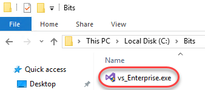

1. If asked to update the installer, do so.

1. Accept the terms to continue.

   

1. After accepting the terms, the installer may offer to update Visual Studio. Click **Cancel** to skip this. While updates are now really fast, they’re not the focus of this lab.

   

1. Click **Modify**. Note that if there are updates available, the **Modify** option may be in the hamburger menu next to **Launch**.

   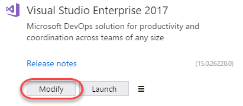

1. The new lightweight and componentized installer breaks down Visual Studio into independent workloads that lets you install just what you need, helping you get going much faster. Some workloads have already been installed on the VM, such as **.NET desktop development** and **Web development**. Selecting these workloads ensured that the installer would set up everything needed to perform the task associated with those types of development, which you can view in the **Summary \| Individual components** section on the right side.

   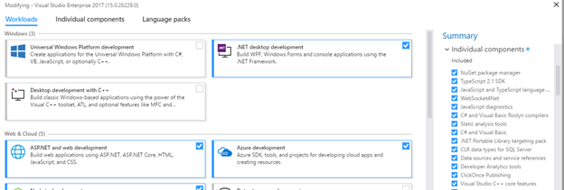

1. However, let’s say that your role has changed and you’re now also working on Universal Windows Platform apps. Click that workload and Visual Studio will calculate what needs to be set up (along with offering optional components).

   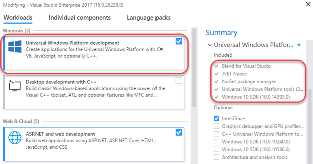

1. Of course you can still select individual components to install, regardless of selected workflow. Select the **Individual components** tab to see a flat list of all the tools, features, and SDKs available.

   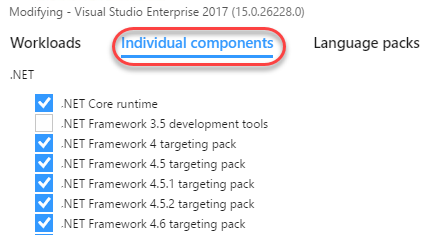

1. Close all installer windows.

### Task 2: Boosting your productivity ###

1. Launch **Visual Studio** from the taskbar.

1. Open the **PartsUnlimited.sln** solution from the **Start Page**.

   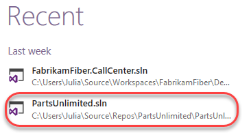

1. **Navigate To** has been completely overhauled and renamed **Go To All**. From the main menu, select **Edit | Go To** and select **Go To All**.

   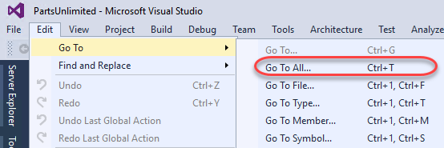

1. **Go To All** consolidates the search experience across project assets and offers easy filtering. Type **“home”** and select different results from the list. Each will open in the temporary editor slot so that you can preview the file contents.

   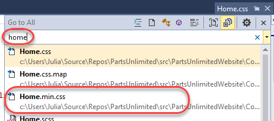

1. Select the **Types** filter. This adds a “t” to the front of the query, indicating that you want to filter by types. You can also manually type that filter yourself in the future to save time. Click **HomeController** and press **Enter** to open it in a permanent slot.

   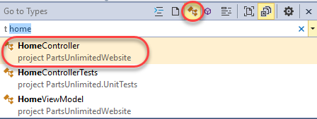

1. Press **Ctrl+T** to reopen **Go To All**. Type **“:”** (a colon) to filter the query to **Go To Line**. Note that there is a tip provided to let you know what input is valid here, such as 1-127 due to the number of lines in the file.

   

1. Finish the search by completing **“: 33”** and clicking the line result provided.

   

1. Make a new line in the source at line **33** and type **“th”**. As expected, **IntelliSense** will jump in with a set of suggestions. In addition, IntelliSense also provides a set of filters at the bottom so that you can zero in on types, properties, etc. It’s also more intuitive about parameters and will default to the option it thinks is best when possible. Plus, IntelliSense supports **dozens** of programming languages out of the box.

   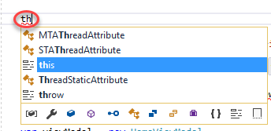

1. Complete typing **“this.GT”**. IntelliSense also recognizes capital letters as shorthand and will refine results based on the available options that fit the typed pattern. In this case there are two valid options for “this” that have capital **G** followed by a capital **T** later in their name. Select **GetTopSellingProducts** to complete the code.

   

1. **Find All References** has also gotten a makeover in Visual Studio 2017. Right-click **GetTopSellingProducts** and select **Find All References**.

   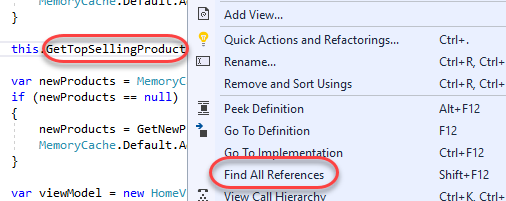

1. The results window is now much more modern with grouping and color. Hovering over the code of one of the results even provides a peek preview.

   

1. Remove the partial line of code you just added in the previous steps.

1. Set a breakpoint at the instantiation of **newProducts** (around line **33**) by clicking the grey bar to its left.

   

1. Press **F5** to launch the site in debug mode. Wait until the breakpoint hits.

1. One of the nifty new features in the debugging experience is the ability to **Run to Click**. Hover next to the line of code at line 40 and click the **Run to Click** button that appears. The debugger will now execute until it hits that line.

   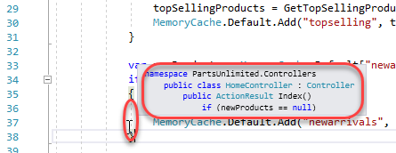

1. After the step, a **PerfTip** will appear next to the current line indicating how long it took to execute to get here. While this number is probably pretty low for this scenario, it might be much larger in others. If you click the **PerfTip**, it will bring you directly to the **Diagnostic Tools** so that you can start reviewing.

    

    

