Lab version:15.0.26228.0

Last updated:3/3/2017

## Overview ##

In this lab, you’ll learn about some of the features in Visual Studio 2017 and Team Foundation Server 2017 that enable collaboration experiences for development teams including Team Rooms, Lightweight Code Comments, and CodeLens.


### Pre-requisites ###

In order to complete this lab you will need the Visual Studio 2017 virtual machine provided by Microsoft. For more information on acquiring and using this virtual machine, please see [this blog post](http://aka.ms/almvm).


## Exercise 1: Team Room Collaboration ##

In this exercise, you will learn about the Team Room feature in Team Foundation Server 2017 (and at visualstudio.com). Team Rooms provide a durable collaboration space where members can chat and view pertinent events, thereby allowing them to remain in loose contact throughout the workday.

### Task 1: Team Rooms Introduction ###

1. Log in as **Sachin Raj (VSALM\Sachin)**. All user passwords are **P2ssw0rd**.

1. Launch **Internet Explorer** from the taskbar and click the **TFS Portal** button from the favorites bar at the top.

    

    > **Note:** There is also a **Web Portal** link in the Team Explorer window within Visual Studio.

   

1. Click the **Rooms** link to navigate to the first team room.

    

    > Note: There is also a team room tile on the home page of each project.

   

1. Each team under a project has a room created for them, which you can browse from the **Rooms Explorer** on the left side of the screen. Select the **Fabrikam Fiber Team Room** to visit that room.

   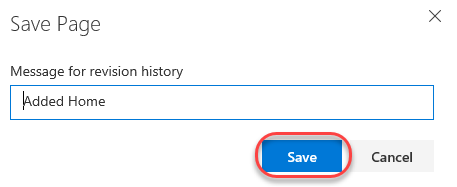

1. On the right side you can participate in team discussions. By default, the room shows the recorded messages and activity for the current day.

   

1. Since the team room content is persistent, team members can go back in time to see what happened while they were gone from work. Click the back arrow to the left of the current date.

   

1. It appears that we didn’t miss anything important in the team room, so we can return to the current date by clicking the **Live** link.

    ###

### Task 2: Team Room Mentions and Links ###

1. Now let’s take a look at some of the types of mentions and links that can be inserted via team room chat. The first type is the team member mention, which can be inserted anywhere by typing the ‘**@**’ symbol followed by the name. As Sachin, try this out by typing “**good morning @**” into the textbox at the bottom of the window. Note that a list of room members is presented as soon as you type the ‘@’ symbol.

   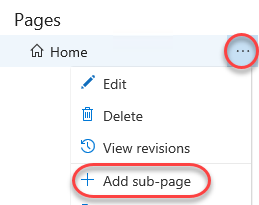

1. Continue typing **“Brian Keller**” or select his name from the list and then press **Enter**.

   

1. Before we move on, go ahead and get another team member connected to the room using remote desktop. Open a new remote desktop session to **“vsalm”** and log in with user name “**VSALM\Brian**” and password “**P2ssw0rd**”. Once connected and logged in, navigate to the **Default Team Room** as you previously did. When asked to switch users later on, simply show or hide the RDP window to “become” the specified user.

1. Note that **Brian’s** view of the message from Sachin renders differently than it would for others since he was the person addressed.

   

1. Another type of mention can be used for referencing project work items. As **Sachin**, add a message to the team that mentions work item #236.

   

1. Click the work item link from the team room chat to see that it does link to the specified work item.

    

   

1. Close the tab showing the work item to return to the team room chat.

1. Some other patterns render as links include URLs, UNC network paths, and email addresses.

    

### Task 3: Team Room Events ###

1. Another key feature of team rooms is that various events can be selected and configured to automatically feed in additional information, thereby providing additional context to active and historical team discussions. Click **Manage events…**.

   

1. The **Configure Events for Fabrikam Fiber Team Room** window that appears shows four different options, **Build Completion**, Code Changes, Work Item Updates, and Code Reviews. Build completion events can be setup to appear whenever selected builds complete.

   

1. Select the **Code Changes** tab. These events can be setup to appear whenever code is checked into selected team projects.

   

1. Click the **Work Item Updates** tab. These events can be setup to appear whenever a work item is created or an existing work item has the state or assignment changed. Let’s set this event up by checking the box next to the area path and then clicking **Save and Close** to use the default options.

   

1. Navigate to work item **#236** in TFS web access by clicking the link in the room chat window.

   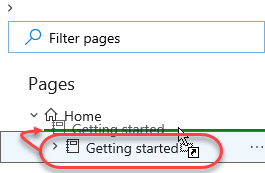

1. Change the work item from state to **In Progress** and then click **Save**.

   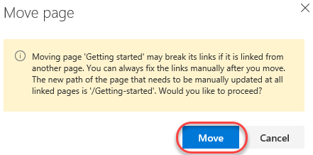

1. Return to the room and note that an event is raised in the chat window describing the state transition. It should only take a moment for it to show up, but you can also refresh the page after a few minutes if needed.

   

1. The Team Room feature has been designed with extensibility in mind, so that will allow development teams to add in custom events and clients in the future. If you are interested in learning more about this extensibility, look at the [Team Rooms REST API](https://www.visualstudio.com/en-us/integrate/api/chat/overview) for more information.

## Exercise 2: Lightweight Code Comments ##

In this exercise, you will learn about the Lightweight Code Comment feature (first introduced with Team Foundation Server 2013), that allows team members to comment on code. This enables interactive or time shifted conversations about code, all from a very nice inline experience in the browser.

### Task 1: Working With Lightweight Code Comments ###

1. Launch **Internet Explorer** from the taskbar and click the **TFS FF Portal** button from the favorites bar at the top.

   

1. Select **Code \| Changesets**.

   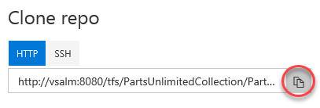

1. Load changeset 75 by entering “**75**” into the changeset search box and pressing **Enter**.

   

1. This changeset contains two file edits, with the changes highlighted in the diff viewer.

   

1. Click the **Add Comment** button to add a comment to the changeset.

   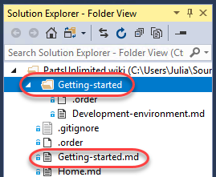

1. Enter a comment such as “What was the reason for changing the connection strings?” Press Enter when done.

   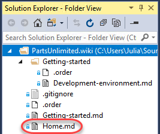

1. To comment on a specific file, click the first **Web.config** link to load that specific edit.

   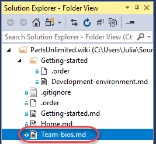

1. Click the **Add Comment** button.

   

1. Add a short comment of your choosing.

   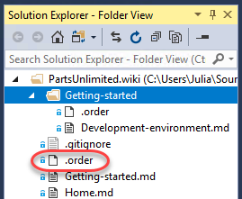

1. Move the mouse cursor over the lines of the file and note that the same **Add Comment** button appears in the margin. Click that button while holding the mouse cursor over one of the lines to add a line comment of your choice.

    

    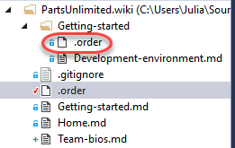

    > **Note:** You can even highlight parts of a sentence and comment on them if desired.

1. Connect to the VM as **Brian** using the same method that you chose in exercise 1, and then navigate to **changeset 75** in the Fabrikam Fiber web portal. Note that you can see the comments left by Sachin.

   

1. Click **reply** within Sachin’s first comment and leave a response to his question.

    

    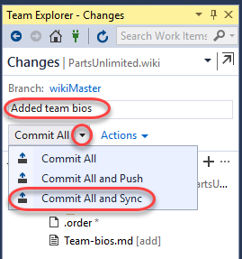

## Exercise 3: CodeLens ##

In this exercise, you will learn about the CodeLens feature first introduced with Visual Studio 2013 and Team Foundation Server 2013 that provides code insights about classes, methods, and properties directly within the code editor.

### Task 1: Working with CodeLens ###

1. Launch **Visual Studio 2017** from the taskbar.

1. From the **Start Page**, open **FabrikamFiber.CallCenter.sln**.

   

1. In **Solution Explorer**, open **FabrikamFiber.Web\Controllers\CustomersController.cs**.

   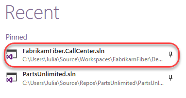

1. Select **Build \| Rebuild Solution**.

1. After loading **CustomersController.cs** in the code editor, note that both the class and its methods show a single line of indicators. These indicators are meant to provide developers a heads-up-display of sorts - with information about how the code is being used, tested, and changed.

    > **Note:** CodeLens is available for managed code only.

   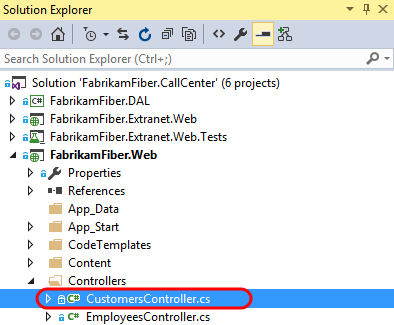

1. Scroll down to locate the **Create** method that takes a **Customer** object as a parameter, and then click the **references** indicator. This shows other code references to this method.

    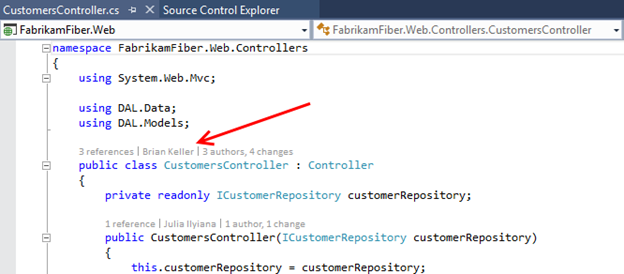

    > **Note:** You can also hold down the **Alt** key and press the number key shown above each indicator as a shortcut.

    

1. If you were to double-click on one of the references, you would be taken to the specified location in code. Press **Esc** instead.

1. Click the **Timeline** indicator above the same **Create** method as before. Note that before clicking it, you can see who made the most recent change.

   

1. Click the **Authors & Changes** indicator to view all authors, changeset descriptions, and dates.

   

1. **Right-click** one of the rows shown for the expanded **Changes** indicator. Note that you can choose to view the diff, view the changeset details, track the changset, get this version, or even send email to the author.

   

1. Press the **Escape** key.

1. Click the **Tested By** indicator shown above the Create method. This lens currently shows that associated tests have not been executed.

   

1. Click **Run All** to execute the tests.

   

1. It appears that one of the tests failed, so click the **Tested By** indicator once again to see which test is causing a problem.

   

1. Let’s take a look at the test itself to determine if the fix needs to happen there or in the Create method being tested. **Double-click** the **CreateNullCustomer** test to navigate to its definition.

   

1. After looking at the **CreateNullCustomer** test, we can see that it is expecting an **ArgumentNullException** to be thrown when the Create method is called with a null parameter. Note that there is also a **Test Status** indicator shown next to the test method itself.

   

1. Select the indicator showing the failed **CreateNullCustomer** test to see additional summary information.

   

1. Throwing this exception seems like a reasonable expectation, so let’s go ahead and make the fix in the Create method. Return to **CustomersController.cs** and add the following code to the beginning of the Create method that takes a Customer parameter.

    ```c#
    if (customer == null)
    {
        throw new System.ArgumentNullException("customer");
    }
    ```
   

1. With the fix in place, click the **Tested By** indicator, single-click on the **CreateNullCustomer** test, and then click **Run** to re-run just the failed test.

   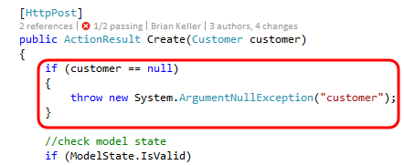

1. All tests that reference the Create method now pass.

    

    > **Note:** With all tests passing, nothing stands out visually in the CodeLens indicator line. This demonstrates one of the goals of CodeLens - to provide useful information without getting in the way or being distracting. Nevertheless the feature can be customized or even turned off in **Tools \| Options** if desired.

    

1. As a final note, CodeLens also supports a number of indicators for Git repositories also. This provides author, change and work item indicators that work very similarly to their Team Foundation Version Control counterparts. Unlike the CodeLens support for TFVC, CodeLens for Git is computed solely on the client side. This means that you can use the feature for any Git repository whether it is local, cloned from TFS Git, cloned from GitHub or another Git source.

